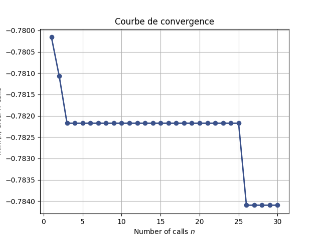
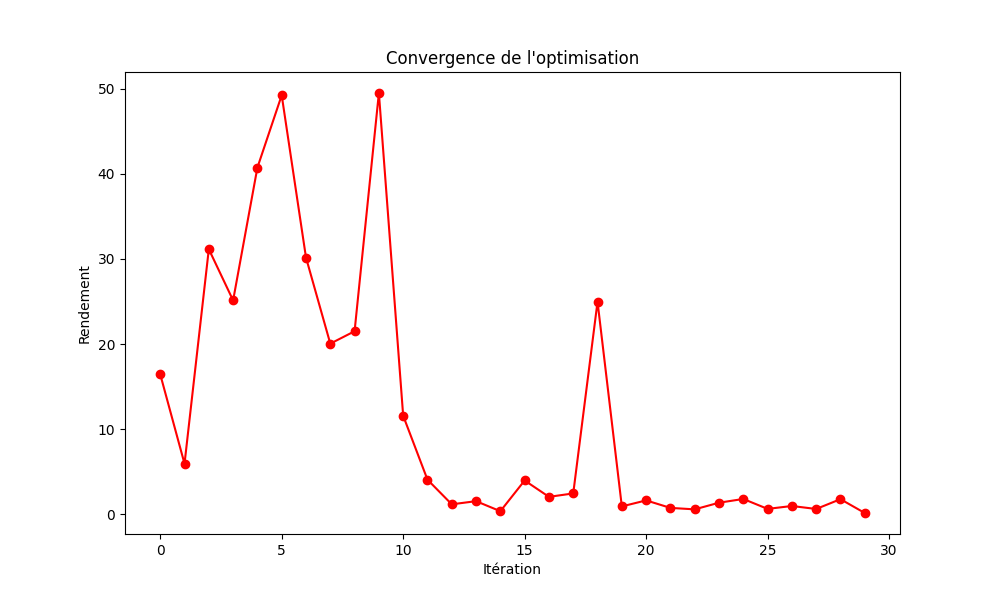
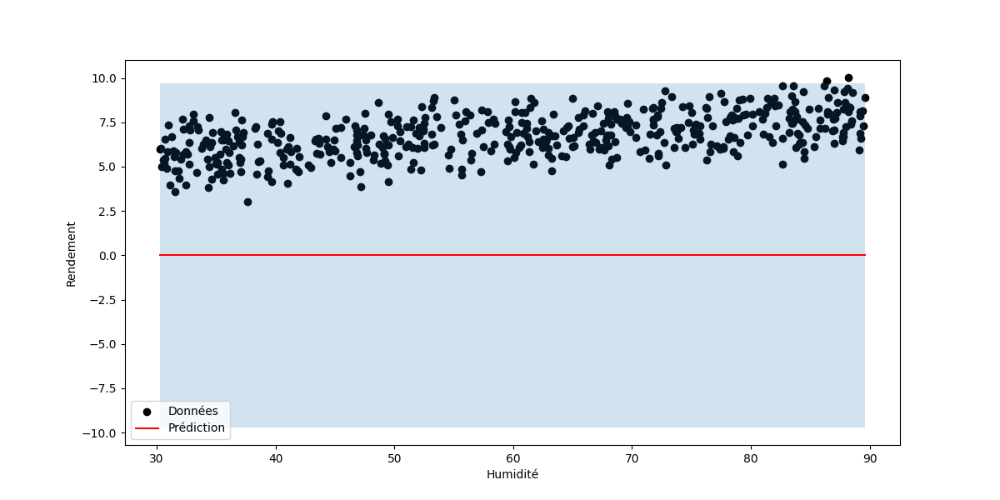

# optimisation_bayesienne

## Partie 1 : Optimisation Bayésienne

## 1. Principe de l’optimisation bayésienne
L’optimisation bayésienne aide à trouver le maximum/minimum d’une fonction coûteuse à évaluer (exemple : temps de calcul élevé).

Elle utilise un modèle de substitution (comme les processus gaussiens) pour prédire la fonction.

Une fonction d’acquisition guide les prochains points à tester, en équilibrant :

- **Exploration** : tester des zones incertaines.
- **Exploitation** : se concentrer sur les zones prometteuses.

## 2. Processus gaussiens
Un **processus gaussien (GP)** est un outil statistique qui modélise une fonction comme une distribution de probabilité.

#### Avantages :
- Il donne à la fois une prédiction et une incertitude pour chaque point.

#### Pourquoi l’utiliser ?
- Idéal pour les fonctions complexes avec peu de données.
- Permet de gérer l’équilibre exploration/exploitation via l’incertitude.

## 3. Fonctions d’acquisition
- **Expected Improvement (EI)** : Mesure l’amélioration attendue par rapport au meilleur résultat actuel.
- **Upper Confidence Bound (UCB)** : Combine la prédiction et l’incertitude (prédiction + \( \beta \times \) incertitude).

#### Rôle :
- **Exploration** : Choix de points avec haute incertitude (UCB).
- **Exploitation** : Choix de points avec haute prédiction (EI).

## Partie 5 : Comparaison des méthodes d'optimisation

### Comparaison des performances

| Méthode d'optimisation | Meilleur score |
|------------------------|---------------|
| Bayesian Search       | 0.7855        |
| Grid Search          | 0.7855        |
| Random Search        | 0.7841        |

### Meilleurs hyperparamètres obtenus

- **Bayesian Search** : `{'max_depth': 7, 'min_samples_split': 4, 'n_estimators': 84}`
- **Grid Search** : `{'max_depth': 10, 'min_samples_split': 5, 'n_estimators': 150}`
- **Random Search** : `{'n_estimators': 200, 'min_samples_split': 2, 'max_depth': 20}`

### Analyse des résultats

- **Performances équivalentes pour Bayesian et Grid Search** : Les deux méthodes atteignent un score de **0.7855**, indiquant que l’optimisation bayésienne ne surpasse pas nécessairement Grid Search sur ce dataset.
- **Random Search légèrement inférieur** : Avec un score de **0.7841**, Random Search montre des performances légèrement moindres, ce qui est attendu puisque cette méthode explore l’espace des hyperparamètres de manière aléatoire.
- **Différence des hyperparamètres** :
  - Bayesian Search sélectionne des paramètres plus restreints en nombre d'arbres (n_estimators = 84), ce qui peut indiquer une optimisation plus efficace.
  - Grid Search tend à tester un ensemble fixe d’hyperparamètres, ce qui explique son choix d’un `n_estimators` plus élevé (150).
  - Random Search choisit un `n_estimators` encore plus élevé (200), ce qui peut entraîner un modèle plus coûteux en calcul sans nécessairement améliorer la performance.

Cette comparaison montre que l’optimisation bayésienne et Grid Search sont de bonnes options pour le réglage des hyperparamètres, avec un léger avantage en efficacité pour l’optimisation bayésienne grâce à sa stratégie d’exploration intelligente.

  
## 6. Analyse du processus d'optimisation

L'analyse de la courbe de convergence révèle :

- **Phase d'exploration initiale** : Grande variabilité des rendements (0-10 itérations).
- **Oscillations importantes** : Pics suggérant exploration et découverte de zones prometteuses.
- **Convergence progressive** : Diminution des variations après l'itération 11.
- **Stabilisation finale** : Valeurs constantes après l'itération 20.
- **Exploration ponctuelle** : Pic à l'itération 18 illustrant le compromis exploration/exploitation.

L’optimisation des hyperparamètres du **RandomForest** montre :

- **Convergence rapide** : Forte amélioration initiale.
- **Plateaux** : Périodes de stabilité suivies de sauts.
- **Affinement final** : Dernière amélioration autour de l'itération 25.
  
## 7. Avantages et limites de l'optimisation bayésienne

### Avantages :
- **Efficacité computationnelle** : Moins d'évaluations nécessaires que Grid Search ou Random Search.
- **Utilisation de l'historique** : Exploite toute l’information disponible.
- **Gestion de l'incertitude** : Mesures d'incertitude pour un échantillonnage intelligent.
- **Robustesse au bruit** : Gestion naturelle des évaluations bruitées.
- **Adaptabilité** : Ajustable à différentes structures de fonctions via le choix du noyau.

### Limites :
- **Malédiction de la dimensionnalité** : Performances réduites pour >20 dimensions.
- **Complexité computationnelle** : Mise à jour GP en \( O(n^3) \).
- **Choix du noyau** : Fortement dépendant des hyperparamètres.
- **Optimisation des hyperparamètres du GP** : Risque d'instabilité.
- **Hypothèses sur la fonction** : Suppose une fonction continue et relativement lisse.

## Partie 2 : Modèles Bayésiens à Noyau

### 8. Inférence bayésienne
L’inférence bayésienne met à jour les croyances (probabilités) avec de nouvelles données.

1. **Définir une distribution a priori** (croyance initiale).
2. **Mettre à jour avec les données** → distribution a posteriori (croyance finale).

#### Exemple :
Si on croit que le rendement dépend surtout de la température (**a priori**), les données peuvent révéler que l’humidité est aussi importante (**a posteriori**).

### 9. Méthodes à noyau
- **Théorie** : Un noyau mesure la similarité entre deux points (exemple : données climatiques).
- **Lien avec les GP** : Les GP utilisent des noyaux pour définir la covariance entre points.

#### Pourquoi l’utiliser ?
- Permet de travailler dans des espaces complexes sans calculs explicites.
- Capture des relations non linéaires (exemple : RBF).

## 10. Distributions a priori et a posteriori
- **A priori** : Croyance initiale avant de voir les données.
  - *Exemple* : « Le rendement suit une loi normale centrée sur 5 t/ha ».
- **A posteriori** : Croyance mise à jour après avoir vu les données.
  - *Exemple* : « Le rendement suit une loi normale centrée sur 7 t/ha, car les données montrent un impact fort des précipitations ».

## 13. Analyse de l'incertitude dans les prédictions

L'analyse des zones d'incertitude dans le modèle de régression bayésienne révèle plusieurs aspects importants :

- **Variation de l'incertitude avec la densité des données** : L'intervalle de confiance (zone bleu clair) est plus étroit dans les régions où les données sont abondantes (entre 50-70% d'humidité) et s'élargit considérablement aux extrémités.
- **Incertitude aux limites du domaine** : Augmentation significative aux valeurs extrêmes d'humidité (~30% et >80%).
- **Incertitude avec données contradictoires** : Mesures contradictoires entraînant une incertitude élevée.
- **Impact du bruit de mesure** : Le paramètre \( \alpha = 0.1 \) du modèle GPR indique une prise en compte du bruit.
- **Zones de confiance vs zones d'exploration** : L'optimisation bayésienne cible les régions à forte incertitude.

## 15. Influence des choix de noyau et de la distribution a priori

### Influence du choix de noyau

- **Structure de la fonction modélisée** :
  - RBF : Hypothèse de continuité et de lissage (rendement agricole).
  - Matern : Plus flexible, tolère des variations abruptes.
  - Linéaire : Ne capture que des relations linéaires.
- **Compromis biais-variance** :
  - Noyaux contraints (RBF) peuvent introduire un biais.
  - Noyaux flexibles risquent de sur-apprendre le bruit.
- **Interprétabilité** :
  - Longueurs caractéristiques du RBF indiquent l'échelle des variations importantes.

### Influence de la distribution a priori

- **Impact avec peu de données** :
  - Avec peu d'observations, la prior domine les prédictions.
- **Régularisation** :
  - Une prior informative agit comme régularisateur.
- **Équilibre exploration-exploitation** :
  - Influence la confiance du modèle et l’échantillonnage en optimisation bayésienne.
 
## Graphiques :

